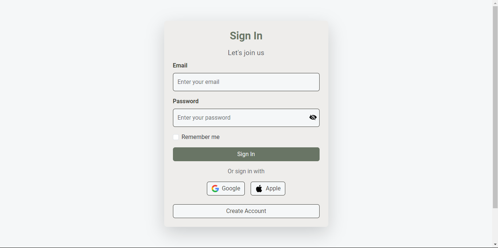
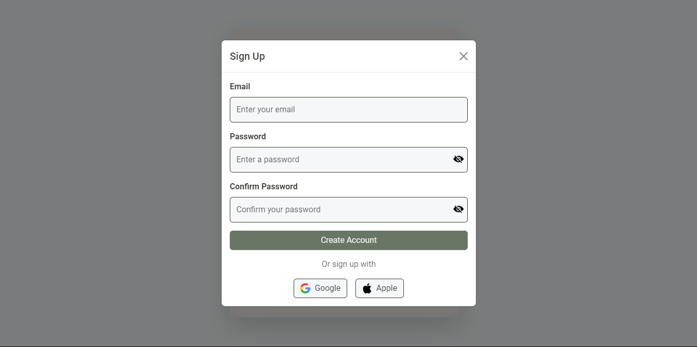

# Login Page
## Sign In & Sign Up Responsive Website Using Bootstrap

A responsive and modern login page with a sign-up modal. Built using **HTML**, **CSS**, **Bootstrap 5**, and **JavaScript**, this project includes user-friendly features such as password visibility toggle, external sign-in options, and a responsive design for various devices.





## Features

- **Login Form**
  - Email and password input fields with placeholder text.
  - "Remember me" checkbox for user convenience.
  - Submit button for signing in.
  - Password visibility toggle.

- **Sign-Up Modal**
  - A modal dialog for creating new accounts.
  - Email, password, and confirm password fields.
  - Password visibility toggle.
  - External sign-up options (Google and Apple).

- **Styling and Design**
  - Clean, modern design using **Bootstrap 5** and custom CSS variables.
  - Responsive layout for mobile, tablet, and desktop devices.
  - Custom color palette with subtle shadows for a professional look.

- **External Authentication Buttons**
  - Google and Apple buttons for potential OAuth integration.

- **Footer Section**
  - Links for "About," "License," "Privacy Policy," and "Terms of Service."
  - Professional footer design with responsive styling.

## Technologies Used

- **HTML5**: For structuring the web page.
- **CSS3**: Custom styling with variables and responsive design techniques.
- **Bootstrap 5**: For layout and components.
- **JavaScript**: For dynamic functionality, including password toggle.

## File Structure

```plaintext
project-directory/
│
├── index.html       # Main HTML file for the login page
├── css/
│   └── style.css    # Custom CSS file
├── js/
│   └── script.js    # JavaScript file for password visibility toggle
├── images/           # Directory for result 
│   ├── SignIn.png
│   └── SignUp.png
└── README.md        # Documentation for the project
